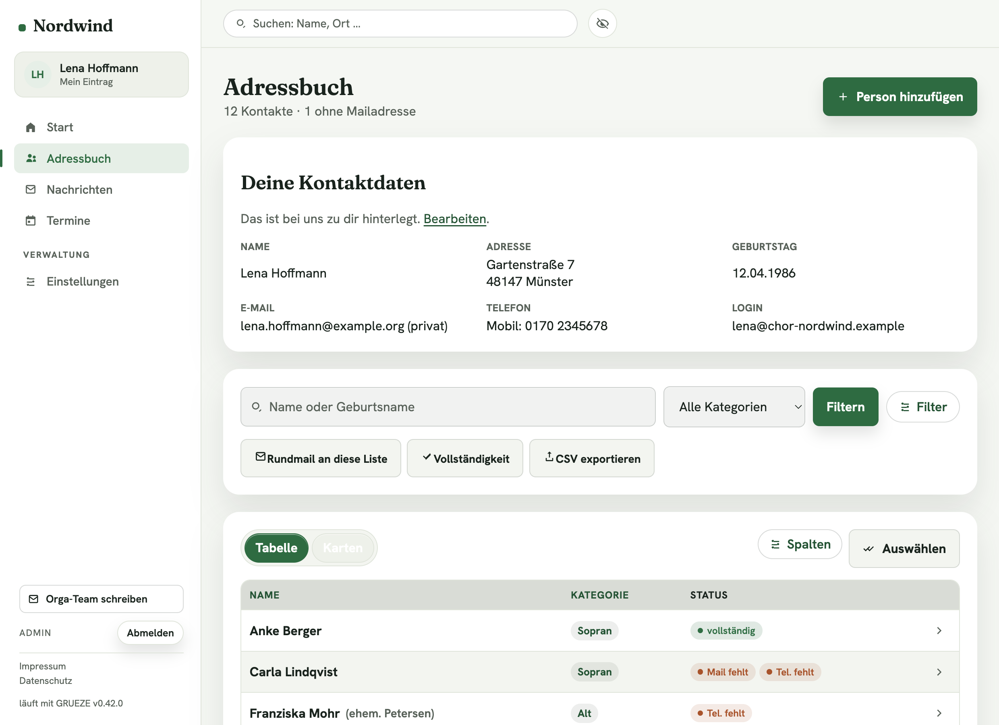
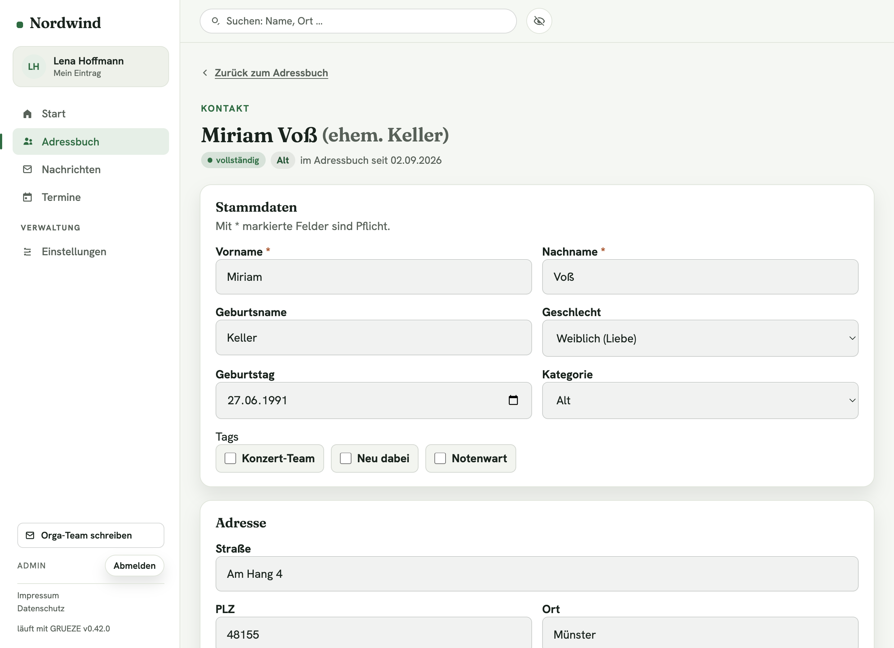
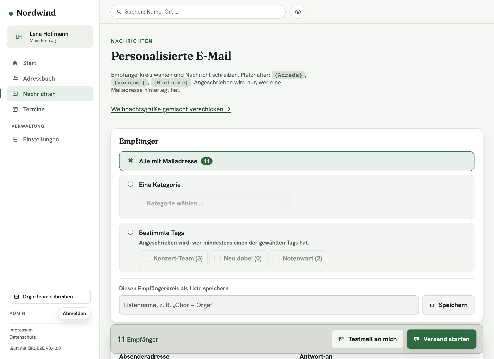
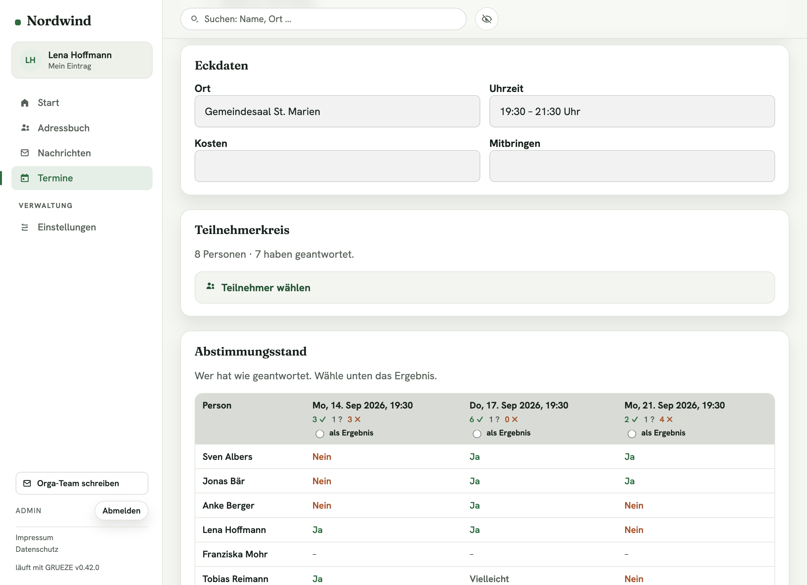
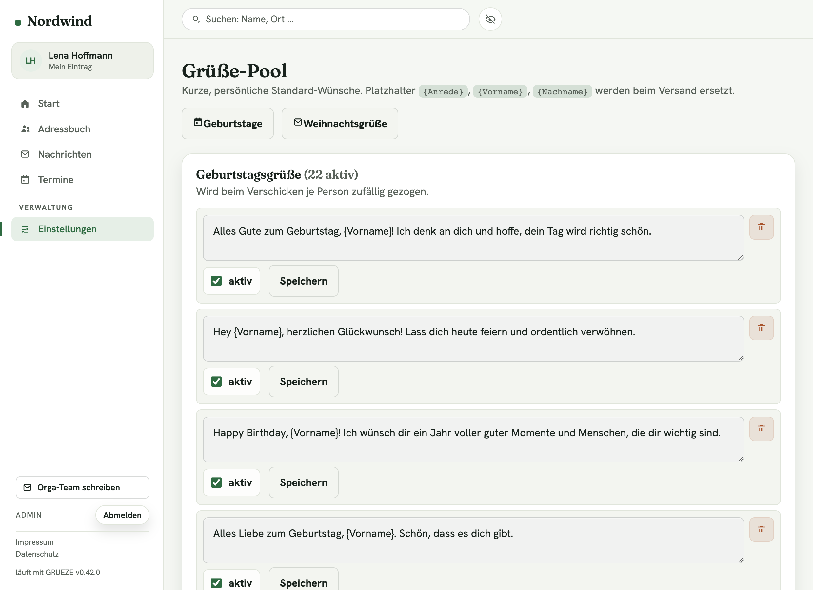
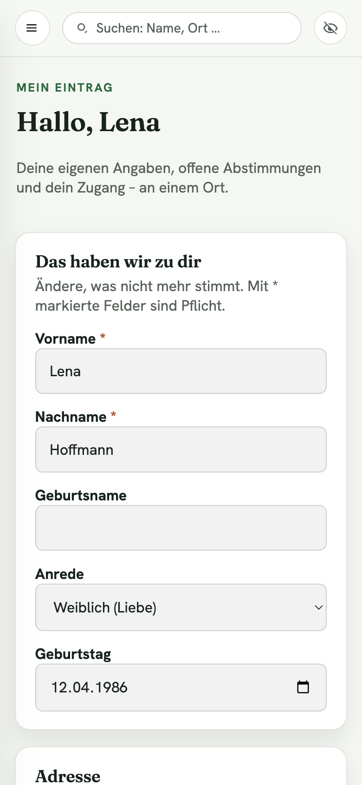

# GRUEZE

**GRUEZE** – **GRU**ppen‑**E**rreichbarkeits‑**ZE**ntrale (und klingt wie „Grüezi") –
ist eine kleine, ruhige Web‑App zum Verwalten von
Kontakten, Rundmails und Terminen – gedacht für Gruppen, die sich selbst
organisieren: Vereine, Familien, Abschlussjahrgänge, Chöre, JGA‑Runden, kleine
Firmen. Kein Framework, kein Build‑Schritt, läuft auf klassischem PHP‑Webspace.

Die App ist **White‑Label**: jede Installation ist eine eigene Instanz mit
eigenem Namen, eigenen Texten und eigenem Farb‑Theme. Zwei Nutzungsarten, eine
App: Admin/Orga verwalten alles am Rechner, alle anderen sehen am Handy eine
schlanke Ansicht mit ihren eigenen Daten und den offenen Abstimmungen.

## Screenshots

| | |
|---|---|
|  |  |
| **Adressbuch** – ruhige Liste, Status je Person, Tabelle ↔ Karten | **Kontakt** – ansehen und bearbeiten auf einer Seite |
|  |  |
| **Nachrichten** – Empfängerkreis + Text, Empfängerzahl live | **Termine** – Datumsabstimmung mit Ergebnismatrix |
|  |  |
| **Grüße‑Pool** – Geburtstags-/Weihnachtswünsche, zufällig gezogen | **Mein Eintrag** – am Handy die eigenen Daten pflegen |

## Was GRUEZE kann

**Kontakte**
- Stammdaten, mehrere Mailadressen und Telefonnummern je Person, Kategorien und
  Tags, Geburtsname („ehem. …"), Profilbild
- Statusanzeige „vollständig / Mail fehlt / Tel. fehlt", eigene Übersichtsseite
  **Vollständigkeit** zum gezielten Nachtragen
- Suche über Name, Geburtsname und Ort, CSV‑Export, Sammelbearbeitung
- **Blickschutz**: alle personenbezogenen Werte auf Knopfdruck unkenntlich
- XLSX‑Import einer bestehenden Namens- und Adressliste (Abgleich am Namen)

**Nachrichten**
- Personalisierter Serienversand (`{Anrede}`, `{Vorname}`, `{Nachname}`)
- Empfängerkreis: alle · eine Kategorie · bestimmte Tags · gefilterte Liste ·
  gespeicherte Empfängerliste – mit Live‑Empfängerzahl
- Versand in kleinen Batches mit Fortschrittsanzeige (kein Timeout auf Shared
  Hosting), jede Mail landet im Versandprotokoll
- **Grüße‑Pool**: kuratierte Kurztexte für Geburtstag und Weihnachten, beim
  Verschicken je Person zufällig gezogen (nicht alle bekommen dieselbe Mail)
- **„Orga‑Team schreiben"**‑Knopf für Mitglieder

**Termine**
- Drei Typen: Datumsabstimmung, fester Termin (mit Zu-/Absagen), Abstimmung ohne
  Datum
- Abstimmen **ohne Login** über einen persönlichen Token‑Link je Person; das Tool
  erkennt Mehrfachnutzung und warnt bei fremden Links
- Ergebnismatrix, „Ergebnis als Termin festlegen", Verlauf der Abstimmung,
  Archiv
- Abstimmungslink direkt aus den Nachrichten mitverschicken (`{Abstimmungslink}`)

**Zugänge & Sicherheit**
- Rollen frei anlegen/umbenennen, Rechte‑ und Sichtbarkeitsmatrix pro Feld
- **Passkeys** (Face ID / Touch ID / Windows Hello / Sicherheitsschlüssel) neben
  Passwort, Passwort‑Reset per Mail, Brute‑Force‑Bremse
- **Selbst‑Registrierung**: Einladungslinks, Selbst‑Anmeldung mit bekannter
  Adresse (Bestätigung per Klick), Freigabe‑Warteschlange für unbekannte Adressen
- CSRF‑Schutz, gehärtete Sessions, PDO‑Prepared‑Statements durchgängig

**Betrieb**
- White‑Label über Oberfläche und `config.php` (Name, Logo, Texte, Rechtstexte)
- **Themes**: 15 Farben, 2 Schriften, Eckenradien – Editor mit Live‑Vorschau und
  Kontrastprüfung; drei Vorlagen mitgeliefert
- Voll‑Backup als ZIP, Wiederherstellung in drei Modi (ersetzen / nur wenn leer /
  zusammenführen)
- **Update per Klick**: „Verwaltung → Aktualisieren" wendet offene
  Datenbank‑Migrationen an und legt vorher eine Sicherung an
- Zugänglich nach WCAG 2.1 AA (Tastaturbedienung, Fokus, Kontraste, Live‑Regionen)

## Systemvoraussetzungen

- **PHP 8.2** oder neuer, mit `pdo_mysql` und `zip` (für den XLSX‑Import)
- **MariaDB 10.4+** oder **MySQL 8.0+**
- Ein **SMTP‑Postfach** für den Mailversand. Ohne
  [PHPMailer](https://github.com/PHPMailer/PHPMailer) (per Composer) fällt der
  Versand auf `mail()` zurück – dann ohne Anhänge.
- Apache mit `mod_rewrite` und erlaubtem `.htaccess`, `public/` als Webroot.
  Kein Node, kein Build‑Schritt.

## Schnellstart mit Docker

Bildet einen typischen Shared‑Hosting‑Stand nach (PHP 8.2 + Apache + MariaDB).

```bash
git clone https://github.com/thx-2000/grueze.git
cd grueze
cp config/config.example.php config/config.php   # Standardwerte passen für Docker
docker compose up -d
```

- App: <http://localhost:8095> → dort **`/setup/admin`** aufrufen und das erste
  Admin‑Konto anlegen
- Datenbank‑Oberfläche (Adminer): <http://localhost:8096>
  (Server `db`, Benutzer `grueze_user`, Passwort `grueze_dev_pw`, DB `grueze`)

Das Schema wird beim ersten Start automatisch aus `database/schema.sql`
importiert. Stoppen mit `docker compose down` (die Daten bleiben im Volume).

## Produktiv auf Shared Hosting

Ausführlich in **[docs/NEUE-INSTANZ.md](docs/NEUE-INSTANZ.md)**. Kurz:

1. `public/` als Webroot einrichten.
2. `config/config.example.php` → `config/config.php` kopieren und `app.*`,
   `database.*`, `mail.*` eintragen.
3. `database/schema.sql` importieren.
4. Optional `phpmailer/phpmailer` per Composer installieren.
5. `public/assets/uploads/` und `storage/tmp/` beschreibbar machen.
6. `/setup/admin` aufrufen und das erste Admin‑Konto anlegen.
7. Danach in der App unter **Verwaltung** Branding, Theme, Rollen, Mail‑Texte und
   die **Rechtstexte** (Impressum, Datenschutz – Pflicht) einstellen.

### Updaten

Neue Dateien hochladen (`config/config.php` und `storage/` bleiben unberührt),
dann in der App **Verwaltung → Aktualisieren → „Jetzt aktualisieren"**. Das
wendet offene Migrationen an und sichert vorher. Migrationen sind additiv und
idempotent – Bestandsdaten bleiben erhalten.

Für den Upload per `rsync` liegt `scripts/deploy.sh` bereit
(`scripts/deploy.env` mit Zielserver anlegen, siehe `.example`).

## Projektstruktur

```
public/            Webroot: index.php (Bootstrap + Routing), Assets
src/Controllers/   schlanke Controller
src/Repositories/  Datenzugriff (PDO)
src/Services/      Fachlogik (Mail, Backup, Migrationen, Themes …)
src/Support/       Helper, u. a. system_version()
templates/         serverseitig gerenderte Ansichten
themes/            mitgelieferte Farb-/Schrift-Vorlagen
database/          schema.sql + migrations/
config/            config.example.php
docs/              NEUE-INSTANZ.md, REDESIGN.md, screenshots/
```

Mehr zur Architektur: **[ARCHITECTURE.md](ARCHITECTURE.md)**,
Änderungen je Version: **[CHANGELOG.md](CHANGELOG.md)**.

## Lizenz

[PolyForm Noncommercial License 1.0.0](LICENSE) – der Quellcode ist einsehbar
und **für jede nicht‑kommerzielle Nutzung frei**. Das schließt das
Selbst‑Hosten für Vereine, Familien, Jahrgänge und ähnliche Gruppen
ausdrücklich ein. Wer GRUEZE (oder eine abgewandelte Version) kommerziell
anbieten möchte – als kostenpflichtiges Produkt oder als Dienstleistung –
braucht eine separate Lizenz; dafür bitte ein Issue im Repo eröffnen.

---

<sub>GRUEZE entsteht in der Freizeit. Wenn es dir hilft, kannst du mir einen
Kaffee ausgeben: [buymeacoffee.com/thomashageleit](https://buymeacoffee.com/thomashageleit) – ganz ohne Verpflichtung.</sub>
